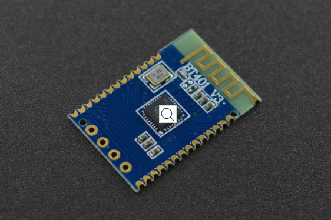

# DFRobot_BT401
蓝牙模块具有蓝牙/ u盘/ tf卡、蓝牙呼叫功能，支持简单清晰的串口控制功能、BLE直通、SPP直通功能。本产品的亮点是双模式蓝牙，这也意味着它可以同时运行蓝牙音频播放和数据传输，大大降低了嵌入式蓝牙在其他产品中的开发难度。





## 产品链接 (https://www.dfrobot.com/product-2177.html)
    DFR0781: Audio & BLE/SPP Pass-through Module - Bluetooth 5.0
## 目录

  * [概述](#概述)
  * [库安装](#库安装)
  * [方法](#方法)
  * [兼容性](#兼容性)
  * [历史](#历史)
  * [创作者](#创作者)
## 概述
1. Play music<br>
2. Answer calls


## 库安装

To use this library, first download the library file, paste it into the \Arduino\libraries directory, then open the examples folder and run the demo in the folder.

## 方法
```C++
  /**
   * @fn begin
   * @brief init function
   * @param s serial
   * @return Boolean type, Indicates the initialization result
   * @retval true The setting succeeded
   * @retval false Setting failed
   */
  bool begin(Stream &s);
  
  /**
   * @fn setBaudRate
   * @brief Set baud rate(Need to power off and restart, power-down save)
   * @param baud 9600,19200,38400,57600,115200
   * @return Boolean type, the result of seted
   * @retval true The setting succeeded
   * @retval false Setting failed
   */
  bool setBaudRate(uint32_t baud);

  /**
   * @fn setPlayMode
   * @brief Set playback mode 
   * @param mode ePlayMode_t:SINGLECYCLE,ALLCYCLE,SINGLE,RANDOM,FOLDER
   * @return Boolean type, the result of seted
   * @retval true The setting succeeded
   * @retval false Setting failed
   */
  bool setPlayMode(ePlayMode_t mode);

  /**
   * @fn setLED
   * @brief Set indicator LED(Power-down save) 
   * @param on true or false
   * @return Boolean type, the result of seted
   * @retval true The setting succeeded
   * @retval false Setting failed
   */
  bool setLED(bool on);
  
  /**
   * @fn setPrompt
   * @brief Set the prompt tone(Power-down save) 
   * @param on true or false
   * @return Boolean type, the result of seted
   * @retval true The setting succeeded
   * @retval false Setting failed
   */
  bool setPrompt(bool on);
  
  /**
   * @fn setVol
   * @brief Set volume 
   * @param vol 0-30
   * @return Boolean type, the result of seted
   * @retval true The setting succeeded
   * @retval false Setting failed
  */
  bool setVol(uint8_t vol);
  
  /**
   * @fn switchFunction
   * @brief Set working mode 
   * @param function eFunction_t:MUSIC,RECORD,UFDISK
   * @return Boolean type, the result of seted
   * @retval true The setting succeeded
   * @retval false Setting failed
   */
  bool switchFunction(eFunction_t function);
  
  /**
   * @fn next
   * @brief Next 
   * @return Boolean type, the result of operation
   * @retval true The setting succeeded
   * @retval false Setting failed
   */
  bool next();
  
  /**
   * @fn last
   * @brief Previous 
   * @return Boolean type, the result of operation
   * @retval true The setting succeeded
   * @retval false Setting failed
   */
  bool last();
  
  /**
   * @fn start
   * @brief Play 
   * @return Boolean type, the result of operation
   * @retval true The setting succeeded
   * @retval false Setting failed
   */
  bool start();
  
  /**
   * @fn pause
   * @brief Pause 
   * @return Boolean type, the result of operation
   * @retval true The setting succeeded
   * @retval false Setting failed
   */
  bool pause();
  
  /**
   * @fn delCurFile
   * @brief Delete the currently-playing file 
   * @return Boolean type, the result of operation
   * @retval true The setting succeeded
   * @retval false Setting failed
   */
  bool delCurFile();
  
  /**
   * @fn playSpecFile
   * @brief Play file of the specific path 
   * @return Boolean type, the result of operation
   * @retval true The setting succeeded
   * @retval false Setting failed
   */
  bool playSpecFile(String str);
  
  /**
   * @fn playFileNum
   * @brief Play the file of specific number, the numbers are arranged according to the sequences the files copied into the U-disk 
   * @param num file number, can be obtained by getCurFileNumber()
   * @return Boolean type, the result of operation
   * @retval true The setting succeeded
   * @retval false Setting failed
   */
  bool playFileNum(int16_t num);

  /**
   * @fn getVol
   * @brief Get volume 
   * @return vol volume
   */
  uint8_t getVol();

  /**
   * @fn getPlayMode
   * @brief Get palyback mode 
   * @return ePlayMode_t  Play Mode
   */
  ePlayMode_t getPlayMode();
  
  /**
   * @fn getCurFileNumber
   * @brief Get file number 
   * @return  file number
   */
  uint16_t getCurFileNumber();
  
  /**
   * @fn getTotalFile
   * @brief Get the number of files available to play 
   * @return Total number of files
   */
  uint16_t getTotalFile();
  
  /**
   * @fn getCurTime
   * @brief Get the time length the current song has played 
   * @return Time node
   */
  uint16_t getCurTime();
  
  /**
   * @fn getTotalTime
   * @brief Get the total length of the currently-playing song
   * @return The total number of time
   */
  uint16_t getTotalTime();
  
  /**
   * @fn getFileName
   * @brief Get the name of the playing file 
   * @return A string representing the filename
   */
  String   getFileName();
  
  /**
   * @fn enableAMP
   * @brief Enable Amplifier chip
   * @return Boolean type, the result of operation
   * @retval true The setting succeeded
   * @retval false Setting failed
   */
  bool enableAMP();
  
  /**
   * @fn disableAMP
   * @brief Disable Amplifier chip
   * @return Boolean type, the result of operation
   * @retval true The setting succeeded
   * @retval false Setting failed
   */
  bool disableAMP();
  
  /**
   * @fn fastForward
   * @brief Fast forward the currently-playing song
   * @param second  FF time(Unit: S) 
   * @return Boolean type, the result of operation
   * @retval true The setting succeeded
   * @retval false Setting failed
   */
  bool fastForward(uint16_t second);
  
  /**
   * @fn fastReverse
   * @brief Fast Rewind the currently-playing song 
   * @param second  FR time(Unit: S)
   * @return Boolean type, the result of operation
   * @retval true The setting succeeded
   * @retval false Setting failed
   */
  bool fastReverse(uint16_t second);
  
  /**
   * @fn setPlayTime
   * @brief Let the currently-playing song start playing from a particular time point 
   * @param second  Fixed time point
   * @return Boolean type, the result of operation
   * @retval true The setting succeeded
   * @retval false Setting failed
   */
  bool setPlayTime(uint16_t second);
```

## 兼容性

MCU                | Work Well    | Work Wrong   | Untested    | Remarks
------------------ | :----------: | :----------: | :---------: | -----
Arduino Uno        |      √       |              |             | 
Mega2560        |      √       |              |             | 
Leonardo        |      √       |              |             | 
ESP32        |      √       |              |             | 
ESP8266        |      √       |              |             | 
M0        |      √       |              |             | 


## 历史

- 2020/12/29 - Version 1.0.0 released.

## 创作者

Written by fengli(eddard.liu@dfrobot.com), 2020.12.29 (Welcome to our [website](https://www.dfrobot.com/))


